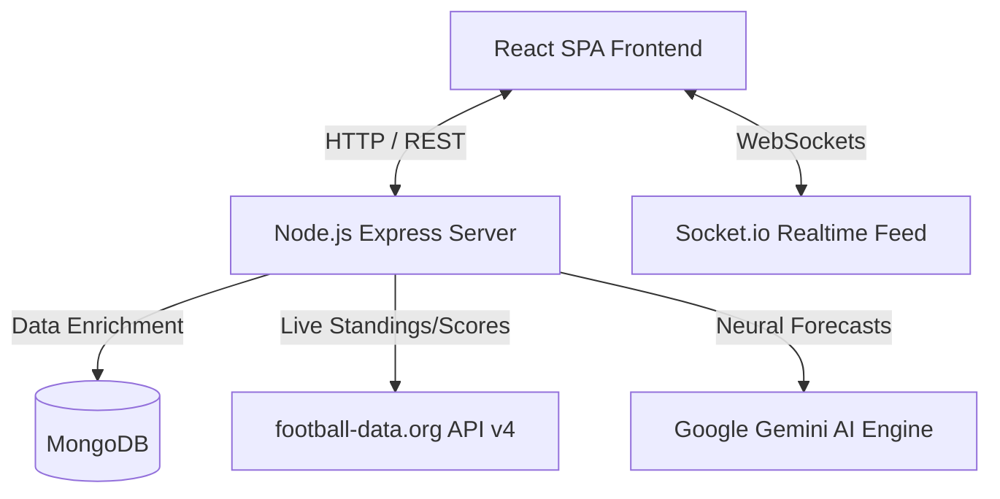
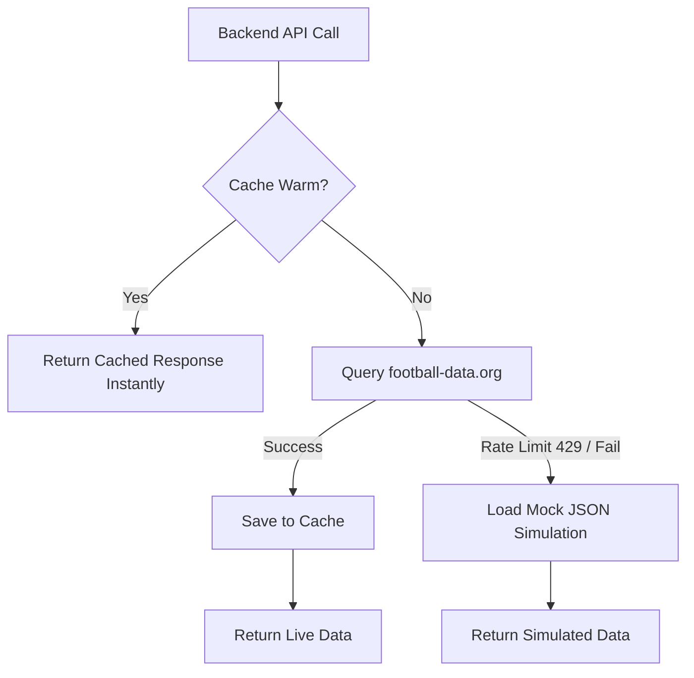

# 🏆 World Cup Fan Dashboard (MERN Stack)

Welcome to the **World Cup Fan Dashboard**—a highly interactive, real-time MERN stack application designed for football fans. It provides live match scores, group standings, team statistics, AI-grounded tactical forecasts, and live community chat rooms with real-time sentiment analysis.

The system is styled with a premium **iOS-style Glassmorphism theme** layered over dynamic stadium wallpapers to give users an immersive, stadium-like experience.

---

## 🏗️ System Architecture

The project follows a standard MERN stack architecture designed for high availability, API resilience, and real-time responsiveness.



### 1. Frontend Client (`/frontend`)
* **Core**: React 18, Vite (for rapid hot-reload and optimized production builds), React Router DOM (client-side routing).
* **Styling**: Tailwind CSS configured with custom theme variables (e.g., `--color-pitch-green`, `--color-trophy-gold`) and vanilla CSS for advanced glassmorphism filters.
* **Icons**: `lucide-react` library.
* **Transitions**: `framer-motion` for smooth, native-like page transitions.

### 2. Backend Server (`/backend`)
* **Core**: Node.js & Express.js.
* **Realtime Synchronization**: `socket.io` broadcast layer for instant, multi-client chat sync.
* **Logger**: `winston` for robust, structured backend diagnostic tracking.
* **Database Client**: `mongoose` ODM for MongoDB integrations.

### 3. Third-Party Integrations
* **Scores & Standings Provider**: `football-data.org` (V4 API) for live match data.
* **AI Analysis Engine**: Google Generative Language API (`gemini-2.0-flash` model) for generating match tactical breakdowns and team summaries.

---

## 🌟 Key Features Implemented

### 1. Live Match Hub Dashboard (`/`)
* Splits matches into three distinct timelines: **Live Now** (with pulsing red neon indicator), **Upcoming Fixtures**, and **Completed Matches** (ordered with the latest matches on top).
* Renders real-time scores, match venues, and exact timing formatted in **GMT/UTC**.
* Features a live countdown timer for upcoming matches, showing the exact remaining time (e.g., `Starts in: 2d 4h 10m`).

### 2. Group Dashboard & Live Standings (`/groups`)
* Renders qualification status (top 2 qualify for knockout rounds), games played, wins, losses, draws, goal differences, and points.
* Integrates dynamic flag mappings on the backend so all countries display correct flags without hardcoding image dictionaries.
* Includes a horizontally scrollable tab menu for all groups, supporting smooth navigation on mobile viewports.

### 3. Teams Explorer & Profiles (`/teams`)
* Displays authentic **FIFA rankings**, head coaches, and star players for all tournament teams (e.g., Argentina: Scaloni & Messi, France: Deschamps & Mbappé, etc.).
* Highlights a widescreen glassmorphic hero banner featuring the archive FIFA World Cup banner.
* Deeply detailed **Team Profiles** displaying wins, goals scored/conceded, goal difference, recent form strings (e.g., `W W W W D`), and a custom SVG performance curve chart.

### 4. Grounded AI Tactical Breakdown
* Clicking **Analyze** on any match sends statistics to Gemini to return a structured analysis.
* Highlights **Pros & Cons** of both sides side-by-side using high-contrast indicators.
* Displays win probabilities, predicted winners, and predicted scorelines.

### 5. Fan Settings & Settings Backgrounds (`/profile`)
* Allows fans to edit their display name, country location, supported team, favorite player, and statement.
* Generates a **Live Profile Card** preview on the fly.
* Dynamically swaps the background wallpaper on the Profile page to a custom Vecteezy design (`profile.jpg`) to make the profile center stand out.

---

## 🛡️ API Resilience & Caching Architecture

The application is built to handle API limitations and network outages gracefully:



### 1. The Cache Shield (Rate Limit Protection)
The free tier of `football-data.org` allows only **10 requests per minute**. To prevent `429 Too Many Requests` errors:
* **Matches** are cached for **30 seconds**.
* **Standings** are cached for **5 minutes**.
* **Teams** are cached for **10 minutes**.
This ensures the backend queries the external API at most twice per minute, providing sub-millisecond response times to client queries.

### 2. Google Gemini API Cache Shield
AI prompts and generated tactical forecasts are cached in-memory. If a user refreshes or re-clicks "Analyze", the backend serves the cached analysis instantly, conserving Google API free-tier quotas and avoiding quota-exceeded `429` blocks.

### 3. Fallback Simulation Engine
If Mongoose fails to connect to MongoDB (e.g., when running offline), or if third-party APIs return rate limits, the server automatically boots into **Database Fallback Simulation Mode**. The server loads static mock databases (`matchesMock.json`, `groupsMock.json`, `teamsMock.json`) and continues running on WebSockets, allowing the UI to remain fully functional.

---

## 🛠️ Installation & Setup

### Prerequisites
* [Node.js](https://nodejs.org/) (v16 or higher)
* [MongoDB](https://www.mongodb.com/) (Optional - falls back to mock server if unavailable)

### 1. Environment Configuration
Create a `.env` file in the `/backend` directory:
```env
PORT=5000
MONGODB_URI=mongodb://localhost:27017/worldcup
FOOTBALL_DATA_ORG_KEY=your_football_data_org_api_key
GEMINI_API_KEY=your_google_gemini_api_key
```

### 2. Backend Setup
```bash
cd backend
npm install
npm run dev
```

### 3. Frontend Setup
```bash
cd frontend
npm install
npm run dev
```
Open `http://localhost:3000` to view the dashboard.

---

## 🚀 Build & Production Deployment

To bundle the React frontend assets for deployment:
```bash
cd frontend
npm run build
```
This generates an optimized `/dist` folder with bundled WebP assets, compressed styling, and dynamic CSS layouts.
